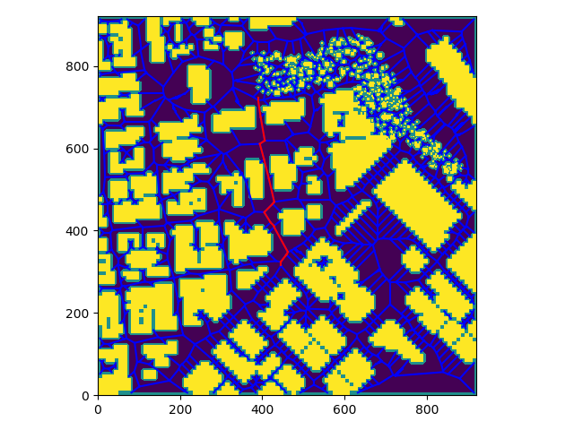

## Project: 3D Motion Planning

---

# Required Steps for a Passing Submission:
1. Load the 2.5D map in the colliders.csv file describing the environment.
2. Discretize the environment into a grid or graph representation.
3. Define the start and goal locations.
4. Perform a search using A* or other search algorithm.
5. Use a collinearity test or ray tracing method (like Bresenham) to remove unnecessary waypoints.
6. Return waypoints in local ECEF coordinates (format for `self.all_waypoints` is [N, E, altitude, heading], where the drone’s start location corresponds to [0, 0, 0, 0].
7. Write it up.
8. Congratulations!  You're Done!

## [Rubric](https://review.udacity.com/#!/rubrics/1534/view) Points
### Here I will consider the rubric points individually and describe how I addressed each point in my implementation.  

---
### Writeup / README

#### 1. Provide a Writeup / README that includes all the rubric points and how you addressed each one.  You can submit your writeup as markdown or pdf.  

You're reading it! Below I describe how I addressed each rubric point and where in my code each point is handled.

### Explain the Starter Code

#### 1. Explain the functionality of what's provided in `motion_planning.py` and `planning_utils.py`
These scripts contain a basic planning implementation that uses an a* version for grids 
and a modification of the backyard_flier code to include planning instead of flying in a square. 

The major difference of `motion_planning` to `backyard_flier` is a new flight state `PLANNING`. 
Correspondingly, the callbacks are set up to go through the `PLANNING` stage between `ARMING` and `TAKEOFF`.

The planning stage is implemented in the `plan_path()` function. That contains a pretty straightforward 
implementation of basic planning as explained in the lessons: get a grid from the csv file, 
run a* with up/down/left/right actions, convert these to waypoints, save them in self 
and feed then to the simulator for display.

### Implementing Your Path Planning Algorithm

#### 1. Set your global home position
Here students should read the first line of the csv file, extract lat0 and lon0 as floating point values and use the self.set_home_position() method to set global home. Explain briefly how you accomplished this in your code.

Done in the `grid.read_lat_lon()` function. Open text file, read first line, split, cast to float, return ;)
Then call `self.set_home_position`

#### 2. Set your current local position
Here as long as you successfully determine your local position relative to global home you'll be all set. Explain briefly how you accomplished this in your code.

That's automatically updated when I update my home position; I calculate it separately  
on line 186 of motion_planning.py to keep the rubric happy :)

#### 3. Set grid start position from local position
This is another step in adding flexibility to the start location. As long as it works you're good to go!
Lines 203-206. Add offsets to local position and round to get grid indices.

#### 4. Set grid goal position from geodetic coords
This step is to add flexibility to the desired goal location. Should be able to choose any (lat, lon) within the map and have it rendered to a goal location on the grid.

Lines 208-226. I first select a random feasible point on the grid, convert that to
geodetic coordinates using `local_to_global`, then convert it back to local, and 
then to grid indices

#### 5. Modify A* to include diagonal motion (or replace A* altogether)
Minimal requirement here is to modify the code in planning_utils() to update the A* implementation to include diagonal motions on the grid that have a cost of sqrt(2), but more creative solutions are welcome. Explain the code you used to accomplish this step.

Implementation with diagonal moves is in astar.py, `a_star_grid()` and the functions it calls.

However, I'm not using that as I decided to have some fun and generate points from the medial
skeleton instead. That implementation is in medial_graph.py. I first start with a 
grid with a safety margin of 0, then invert it and erode it for int(1.5*safety_margin) steps.

I also define grid edges as obstacles so the medial skeleton doesn't hug the edges

I then take the medial axis transform of the result, and convert it into a graph by connecting
neighboring points. 

I believe erosion and medial axis are better approaches to enforcing safety 
margin and finding a 'nice' graph skeleton than adding the safety margin to 
the rectangles and using Voronoi from obstacle centers, as the representation
of obstacles as rectangles with centers is pretty artificial, and a representation
as a grid of on-off points is in contrast pretty universal - and my approach uses
only the grid.

#### 6. Cull waypoints 
I go a slightly different path here, inspired by the sensor fusion course, namely
start at a graph node that has one or more than two outgoing edges, pick one of these 
edges, and walk along that chain one hop at a time. After each hop, I check whether all the 
points between start and end are close to a straight line connecting start and end 
(`all_on_straight line` function). Once that is no longer the case, or I encounter another point with 
number of edges different from 2, I stop and discard the in-between points, replacing them
with an edge between start and end point. I then add this new end point to the list of points 
to be processed, and pick the next such point.

#### 6a. Call A* on the medial graph
As I do the culling at the graph construction stage, before any planning, 
the resulting graphs end up much smaller and thus faster to plan over.
I use the standard A* for graphs implementation from the exercises.

Here a picture with the grid, eroded grid that I derive the medial points from,
medial axis graph, and sample path

### Execute the flight
#### 1. Does it work?
It works!

### Double check that you've met specifications for each of the [rubric](https://review.udacity.com/#!/rubrics/1534/view) points.
  
# Extra Challenges: Real World Planning

For an extra challenge, consider implementing some of the techniques described in the "Real World Planning" lesson. You could try implementing a vehicle model to take dynamic constraints into account, or implement a replanning method to invoke if you get off course or encounter unexpected obstacles.

